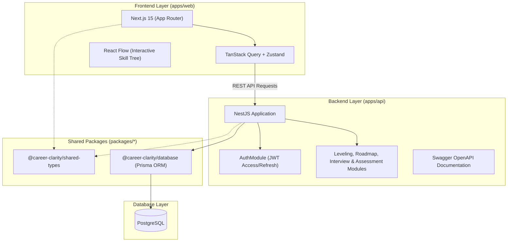

# 🧭 Career Clarity

> **Production-grade career clarity & leveling platform for software engineers in the AI era.**  
> Benchmark cross-company levels, navigate high-leverage skill trees, and ace role-calibrated technical interviews.

---

## 🌟 Overview & Problem Statement

Software engineers—particularly those progressing from mid-level to senior positions—frequently encounter three major ambiguities:

1. **Leveling Discrepancies:** A "Senior" title at a local startup may translate to "L4 / Mid" at Google or Meta. Engineers lack transparent benchmarks across global tech tiers.
2. **AI-Era Skill Relevance:** With AI coding tools (Claude Code, Cursor, Copilot) transforming daily engineering workflows, engineers struggle to identify which skills remain irreplaceable, which are automated, and which are emerging.
3. **Fragmented Interview Preparation:** Preparation resources are scattered across hundreds of platforms without role-level filtering or structured progression.

**Career Clarity** solves this by providing a unified, data-driven platform:

- 📊 **Cross-Company Level Comparator:** Benchmark competencies against Big Tech (Google, Meta, Amazon) and regional tier standards.
- 🗺️ **Interactive AI-Era Skill Roadmap:** Visual skill tree rendered with React Flow, categorizing skills into _Critical_, _AI-Accelerated_, and _Declining_.
- 🎯 **Targeted Interview Question Bank:** Role- and level-specific technical questions with hints, verified solutions, and progress tracking.
- ⚡ **Personalized Career Dashboard & Assessments:** Automated readiness scoring, skill gap analysis, and next-step recommendations.

---

## 🏗️ Architecture & Monorepo Structure

The project is structured as an enterprise-grade monorepo powered by **Turborepo** and **pnpm workspaces**:

```
career-clarity/
├── apps/
│   ├── web/                     # Next.js 15 App Router Frontend (React 19, Tailwind CSS, shadcn/ui)
│   └── api/                     # NestJS Layered Architecture Backend (REST API, Swagger, JWT Auth)
├── packages/
│   ├── database/                # Prisma ORM schema, client export & migrations (PostgreSQL)
│   ├── shared-types/            # Shared TypeScript domain contracts, DTOs & API response envelopes
│   └── typescript-config/       # Unified tsconfig presets (base, nextjs, nestjs)
├── .github/
│   └── workflows/               # Automated CI/CD pipelines (Lint, Test, Build)
├── .husky/                      # Git hooks (pre-commit quality guards)
├── turbo.json                   # Turborepo task pipeline orchestration
└── pnpm-workspace.yaml          # Monorepo package workspace definitions
```

### Architecture Diagram



---

## 🛠️ Tech Stack & Engineering Standards

| Area                      | Technology                                                                                 | Rationale                                                                                     |
| :------------------------ | :----------------------------------------------------------------------------------------- | :-------------------------------------------------------------------------------------------- |
| **Monorepo Engine**       | [Turborepo](https://turbo.build/) + [pnpm](https://pnpm.io/)                               | High-performance remote caching, fast dependency resolution, strict package isolation.        |
| **Frontend Framework**    | [Next.js 15](https://nextjs.org/) (App Router)                                             | Server Components, optimized image pipelines, streaming SSR, modern React 19 architecture.    |
| **Styling & UI**          | [Tailwind CSS](https://tailwindcss.com/) + [shadcn/ui](https://ui.shadcn.com/)             | Mobile-first 8px design system, dark/light theme switching, accessible ARIA primitives.       |
| **State Management**      | [TanStack Query v5](https://tanstack.com/query) + [Zustand](https://zustand-demo.pmnd.rs/) | Declarative server-state caching and lightweight client UI state.                             |
| **Interactive Graph**     | [React Flow](https://reactflow.dev/)                                                       | Interactive node-based roadmap visualization with collapsible skill clusters.                 |
| **Backend Framework**     | [NestJS 11](https://nestjs.com/)                                                           | Structured, scalable, enterprise-grade architecture (Controller → Service → Repository).      |
| **Database & ORM**        | [PostgreSQL](https://www.postgresql.org/) + [Prisma](https://www.prisma.io/)               | Strongly-typed schema migrations, relations, and type-safe database queries.                  |
| **API Docs & Validation** | Swagger OpenAPI + `class-validator`                                                        | Automatic interactive documentation at `/api/docs` with strict DTO payload validation.        |
| **Code Quality**          | ESLint 9 + Prettier + Husky + lint-staged                                                  | TypeScript Strict Mode (`no-explicit-any`), automated pre-commit format and lint enforcement. |

---

## 🚦 Roadmap & Implementation Phases

- [x] **Phase 0: Monorepo Foundation & Tooling** (Turborepo, pnpm workspaces, ESLint, Prettier, Husky, Base TSConfigs)
- [x] **Phase 1: Database Architecture & Seeding** (Prisma Schema, PostgreSQL relations, comprehensive seed data)
- [x] **Phase 2: Backend Core Infrastructure** (NestJS setup, JWT Auth with Refresh Tokens, Swagger, Global Filters)
- [x] **Phase 4: Frontend Core Infrastructure** (Next.js 15, Tailwind design tokens, responsive sidebar/header, Onboarding flow)
- [x] **Phase 5: Frontend Feature Pages** (Executive Dashboard, Cross-Company Leveling Comparator, React Flow Roadmap, Interview Bank & Diagnostic Assessment)
- [x] **Phase 6: Integration, Testing & Accessibility** (Auth Guards, 401 Token Refresh Queue, Optimistic Updates, ARIA & Touch Targets, E2E Critical Journey Suite)
- [ ] **Phase 7: Production Deployment & CI/CD** (GitHub Actions CI, Vercel & Railway/Render deployment, environment config)

---

## 🚀 Getting Started

### Prerequisites

- **Node.js**: `v20.x` or higher (tested on `v26.x`)
- **pnpm**: `v9.x` or higher (`npm install -g pnpm`)
- **PostgreSQL**: Local or hosted instance (e.g. Supabase, Neon)

### Installation

1. **Clone the repository:**

   ```bash
   git clone https://github.com/abdulatifmirzaev/career-clarity.git
   cd career-clarity
   ```

2. **Install all dependencies across the monorepo:**

   ```bash
   pnpm install
   ```

3. **Run the development servers:**

   ```bash
   pnpm dev
   ```
   - **Frontend:** [http://localhost:3000](http://localhost:3000)
   - **Backend API:** [http://localhost:3001/api](http://localhost:3001/api)
   - **Swagger Docs:** [http://localhost:3001/api/docs](http://localhost:3001/api/docs)

4. **Lint and Typecheck:**
   ```bash
   pnpm lint
   pnpm check-types
   ```

---

## 🛡️ License

This project is open source and available under the [MIT License](LICENSE).

Developed with precision by [Abdulatif Mirzaev](https://github.com/abdulatifmirzaev).
